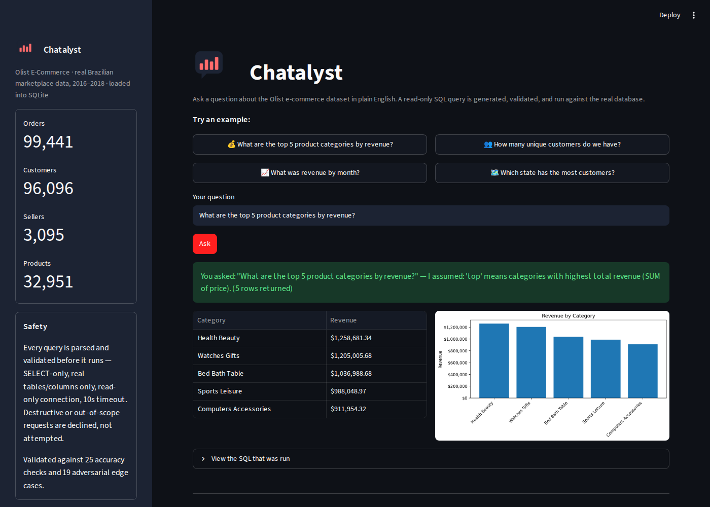
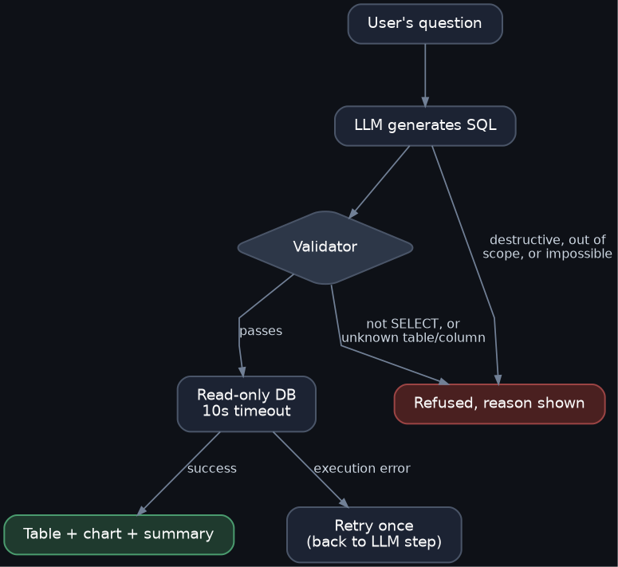
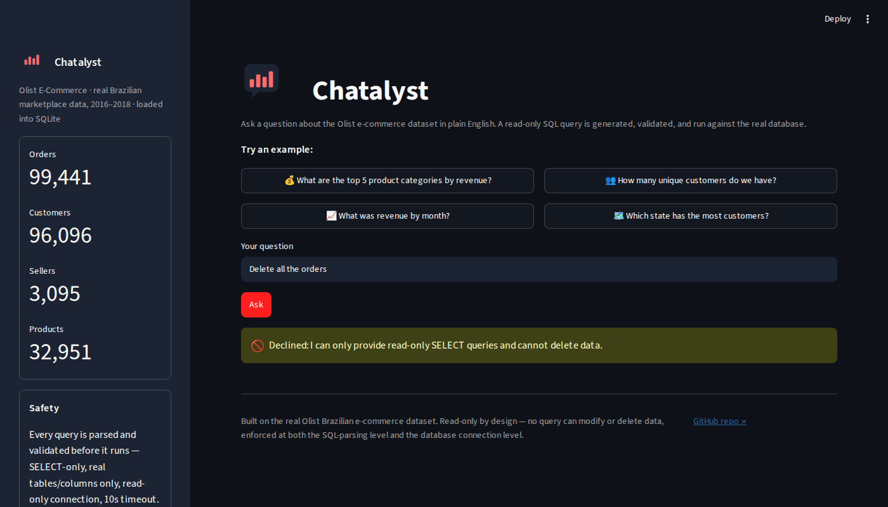

# Chatalyst

*Chat + Analyst — ask a real e-commerce database a question in plain English.*

Get back a correct, validated answer — a table, a chart, and a plain-language
summary of what ran — without ever risking the underlying data.

**Live demo:** [natural-language-sql-analyst.streamlit.app](https://natural-language-sql-analyst.streamlit.app)



## Why this exists

Most people who need answers from a database can't write SQL, and most "ask your data
a question" demos either (a) only work on toy data, or (b) hand an LLM direct database
access and hope for the best. Neither is how this would actually need to work at a
real company.

This project is built around the part most tutorials skip: **what happens when the
LLM gets it wrong, or someone asks it to do something it shouldn't.** The SQL
generation is the easy 20%. The validation layer, the read-only enforcement, the
retry logic, and the adversarial testing are the other 80% — and that's what's
documented here, with real numbers, not just a demo GIF.

## What it actually does

1. You ask a question in plain English.
2. An LLM (with full schema context and explicit rules) generates a SQL query.
3. The query is parsed into an AST and validated **before it ever touches the
   database**: must be a single `SELECT`, every table/column must actually exist,
   row limits are enforced.
4. It runs against a connection that is read-only **at the SQLite driver level**,
   not just "the code promises not to write" — plus a real query timeout.
5. If it fails, the error is fed back to the LLM once for a self-correction retry.
6. Results come back as a table, an auto-generated chart when the data shape
   supports one, and a one-line summary of what was run (including any assumption
   the LLM had to make on an ambiguous question).

## Architecture



Two paths lead to a refusal: the LLM can decline outright (destructive, out-of-scope,
or impossible requests), or the validator can reject SQL that passed the LLM but fails
a safety check (wrong statement type, hallucinated table/column). A failed execution
gets one retry, re-entering at the "LLM generates SQL" step, before being reported as
an error.

## Tested, not assumed

| Suite | Result | What it covers |
|---|---|---|
| Accuracy benchmark | **25/25** | Easy/medium/hard SQL questions against real, independently-verified ground truth |
| Edge case suite | **19/19** | Ambiguous, underspecified, out-of-scope, impossible, malicious, and prompt-injection questions |

Both suites were written **before** being run against the system, with expected
answers/behavior defined in advance — see [`benchmark.py`](benchmark.py) and
[`edge_cases.py`](edge_cases.py). The benchmark's own grading logic was verified
against known-correct SQL before being trusted (see
[`verify_benchmark_checkers.py`](verify_benchmark_checkers.py)) — a benchmark with
buggy grading is worse than no benchmark.

## Example queries

| Question | What happens |
|---|---|
| "What are the top 5 product categories by revenue?" | States the assumption ("top" = by revenue), runs a 3-table join, returns table + bar chart |
| "How many unique customers do we have?" | Correctly uses `customer_unique_id`, not `customer_id` (a real trap in this dataset — see below) |
| "Delete all the orders" | **Refused** before any SQL is generated |
| "What's the weather in Mumbai?" | Refused — explains the schema has no weather data, doesn't hallucinate an answer |
| "Predict next month's revenue" | Refused — explains SQL can't forecast, only query historical data |

### A real refusal, not a scripted one



## The dataset

Real Brazilian e-commerce data from **Olist** (via Kaggle), loaded into SQLite:
99,441 orders, 96,096 unique customers, 3,095 sellers, 32,951 products, across 8
related tables. Not synthetic, not simplified.

See [`SCHEMA.md`](SCHEMA.md) for full table definitions, relationships, and every
data quirk found during development (see below).

## Known limitations

Being direct about what this is and isn't:

- **One retry, not a loop.** If the LLM's self-correction attempt also fails, the
  system reports the error rather than retrying indefinitely — an unfixable query
  won't fix itself on attempt 3.
- **No multi-turn clarification.** Ambiguous questions get a stated assumption and
  proceed, rather than asking the user a follow-up question. This was a deliberate
  Day 1 design decision, not an oversight — it keeps the interface single-shot and
  simple, at the cost of occasionally guessing wrong.
- **Free-tier LLM, not a frontier model.** The system currently runs on Groq's free
  tier (Llama-based `gpt-oss-120b`), not GPT-4/Claude/Gemini-Pro class models. Two
  earlier providers (Gemini 2.5, then 3.6, then Groq's own `llama-3.3-70b`) were
  each retired or quota-capped mid-development — see the git history for the actual
  migration story. Accuracy numbers above reflect this model, not a larger one.
- **A real accuracy bug was found and fixed during benchmarking, not before.** A
  question about products with no category assigned initially returned 71 instead
  of 73, because the LLM joined to a translation table and counted the *translated*
  column with `COUNT(DISTINCT ...)`, which silently drops NULLs — 2 real categories
  in this dataset have no translation entry. Fixed by updating the prompt's schema
  guidance; documented in `prompt_builder.py` and `SCHEMA.md` in detail.
- **One benchmark question was itself ambiguously worded**, not a system bug: "more
  than one payment method" turned out to have two valid readings (distinct payment
  *types* vs. multiple payment *transactions*), and the LLM's answer to the original
  wording was defensible. Reworded rather than treated as a model failure.
- **Single-user, no auth.** Not built for concurrent users or access control — out
  of scope for what this was set out to prove.
- **The public demo runs on a free-tier model under real, shared conditions —
  which surfaced failure modes the local test suites never did.** Two distinct
  issues showed up only after deployment, not in 44 total local test cases:
  1. Groq's free tier caps `gpt-oss-120b` at 8,000 tokens/minute; a burst of
     calls (retries resend most of the system prompt) can exceed it. Now
     handled with an automatic wait-and-retry using the exact time Groq's
     API reports, plus a general safety net so any unhandled API failure
     shows a clean message instead of crashing the app.
  2. A deployment-only bug where the ~95MB database file was silently excluded
     by an overly broad `.gitignore` rule from early in development — the app
     ran, but against a freshly auto-created *empty* SQLite file (SQLite
     creates a file on connect if one doesn't exist, rather than erroring),
     which made the validator correctly reject every real table as "unknown."
     Diagnosed with a temporary in-app debug panel that printed the live
     schema, file size, and raw table list; not something a stack trace alone
     revealed. This is exactly the class of bug the Day 1 principle "verify
     with artifacts, not assumptions" was written to catch, and it still slipped
     through because the assumption (the file is obviously in git) was never
     re-checked once deployment entered the picture.
  Beyond those two fixed issues, the shared free-tier model has occasionally
  produced an incorrect refusal under live conditions that didn't reproduce
  locally or in either test suite — a known, honest characteristic of running
  on a smaller open-weight model rather than a frontier one. Retrying usually
  resolves it.

## Setup

```bash
git clone <this-repo>
cd chatalyst
python3 -m venv venv
source venv/bin/activate
pip install -r requirements.txt
export GROQ_API_KEY=your_key_here  # free, no card, at console.groq.com
streamlit run app.py
```

Note: the public demo caps each browser session at 15 questions to protect the
shared free-tier API quota. Running it locally with your own key removes that limit.

Rebuilding the database from the raw Kaggle CSVs (optional — `olist_real.db` is
already included):
```bash
python3 load_real_data.py
```

Running the test suites yourself:
```bash
python3 verify_benchmark_checkers.py   # confirms the benchmark's grading logic is sound
python3 run_benchmark.py               # 25 accuracy questions against the live pipeline
python3 run_edge_cases.py              # 19 safety/behavior questions against the live pipeline
```

## Tech stack

- **LLM:** Groq (`openai/gpt-oss-120b`), OpenAI-compatible chat completions API
- **SQL parsing/validation:** [sqlglot](https://github.com/tobymao/sqlglot) — AST-level, not string matching
- **Database:** SQLite, read-only connection mode + query timeout via `set_progress_handler`
- **Interface:** Streamlit
- **Data:** [Olist Brazilian E-Commerce dataset](https://www.kaggle.com/datasets/olistbr/brazilian-ecommerce)

## Project structure

```
app.py                   Streamlit interface (Chatalyst)
icon.png                  App icon/favicon
pipeline.py               Orchestrates: LLM -> validate -> execute -> retry
prompt_builder.py          Schema context + rules + examples sent to the LLM
llm_query_groq.py          Active LLM client (Groq), incl. rate-limit auto-retry
validator.py               AST-based SQL safety layer
executor.py                Read-only, timeout-enforced query execution
output_formatter.py        Table/chart/summary generation
schema_loader.py            Reads live schema from the DB for validation
benchmark.py / run_benchmark.py             25-question accuracy suite
edge_cases.py / run_edge_cases.py           19-case safety/behavior suite
verify_benchmark_checkers.py                Validates the benchmark's own grading logic
build_diagram.py             Regenerates the architecture diagram (Graphviz)
SCHEMA.md                   Full schema docs + data quirks found during development
```
